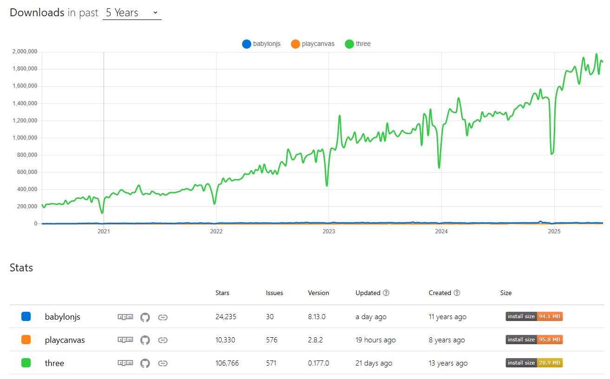
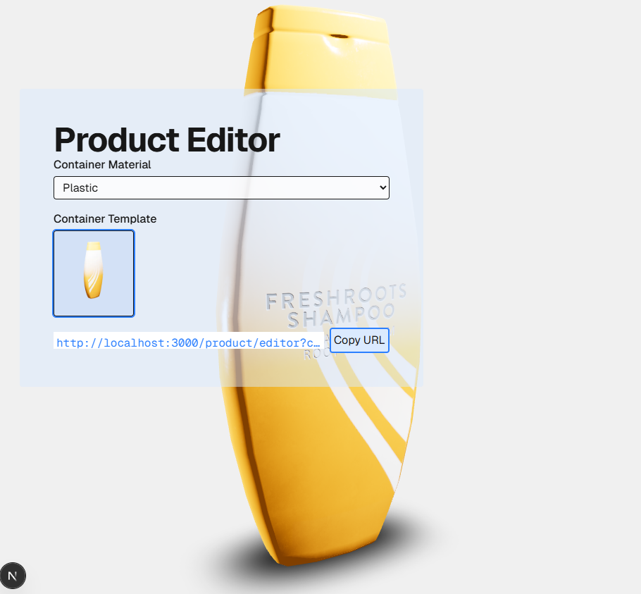
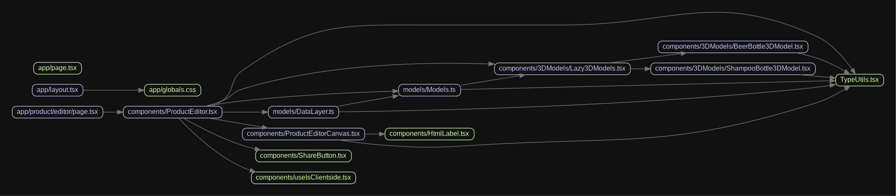

# 3D demo web app

## Goal

- [x] Demo a 3D SPA using your chosen 3D framework
- [x] Ensure application is **responsive** and works on **standard desktop browsers**

## The state of 3D web rendering

While many 3D rendering libraries are currently available, my cursory research highlighted the following contenders:

1. [three.js](https://threejs.org/)
1. [Babylon.js](https://www.babylonjs.com/), 24K stars on Github
1. [PlayCanvas](https://playcanvas.com/)

### 3D library pros & cons

| Name                                     | Pros                                                                                                                                                                                                                                                                                                                                     | Cons                                                                                                       | Github ⭐ |
| ---------------------------------------- | ---------------------------------------------------------------------------------------------------------------------------------------------------------------------------------------------------------------------------------------------------------------------------------------------------------------------------------------- | ---------------------------------------------------------------------------------------------------------- | --------- |
| [three.js](https://threejs.org/)         | <br>- Wide 3D rendering features <br>- Mature React integration via [React Three Fiber](https://r3f.docs.pmnd.rs/getting-started/introduction) (29K⭐) <br>- Collection of ready-made "plugins" via [Drei](https://drei.docs.pmnd.rs/getting-started/introduction) (9K⭐) <br>- Continuous historical growth                             | - Complexity due to low-level graphics API <br>- No professional support AFAICT                            | 107K⭐    |
| [Babylon.js](https://www.babylonjs.com/) | <br>- Wide 3D rendering features <br>- 3D Editor <br>- [React-Babylonjs renderer](https://github.com/brianzinn/react-babylonjs) (0.9K⭐ ) <br>- Supported by Microsoft                                                                                                                                                                   | - Extraneous features due to being a game engine (E.g. physic engine) <br>- Smaller community than threejs | 24K⭐     |
| [PlayCanvas](https://playcanvas.com/)    | <br>- Wide 3D rendering features <br>- Comprehensive 3D Editor & Asset tooling <br>- Online integration via [Web Component API](https://developer.playcanvas.com/user-manual/web-components/) or [React renderer](https://playcanvas-react.vercel.app/docs/guide/getting-started) <br>- [Paid app hosting](https://playcanvas.com/plans) | - Extraneous features due to being a game engine (E.g. physic engine) <br>- Much smaller community         | 10K⭐     |

All three engines support advanced rendering features like PBR texturing or transparency.

_See also this [Wikipedia WebGL frameworks comparison table](https://en.wikipedia.org/wiki/List_of_WebGL_frameworks) for more info._

### npm download trends of babylonjs vs playcanvas vs three.js in the last 5 years


[_Source_](https://npmtrends.com/babylonjs-vs-playcanvas-vs-three)

### Which 3D library to choose?

It's clear that three.js is the most mature & popular 3D WebGL library out there. It has a large active community providing lots of reusable code samples and, after 11 years of activity, shows no sign of slowing down.

On the other hand, Babylon.js and PlayCanvas are still very potent contenders thanks to their graphic feature completeness and e2e production tooling. But they seem to appeal to a smaller professional audience (e.g. game studios) as they are built & marketed as game engines; which is overkill for most general web applications.

For the purpose of this 3D demo app, I'll use three.js.

## Installation

```bash
pnpm install
pnpm build --turbo
pnpm start
```

Open [http://localhost:3000](http://localhost:3000) with your browser to see the result.

### Preview



### Development

It's recommended to use Docker to create a build & run this demo in a container:

```bash
# CWD: this git repo
scripts/docker/build_n_dev.sh
```

# You can then run this command in the Docker container:

```bash
pnpm dev
```

# Known limitations

- This demo simulates backend connections via an async DataLayer API.
- Limited Jest unit testing since webGL canvas isn't available by default. Ideally, e2e tests would add better test coverage.
- Jest `--watch` feature doesn't detect file changes on Windows + Docker. Just trigger test reruns manually...
- DataLayer is not fully used yet
- Default 3D scene & camera settings are still hard-coded in a React component

# Known issues

- When loading the product editor with the beer bottle model by default, the view is occluded because the camera position is inside the bottle.
- A "Loading..." notification is supposed to appear when the 3D model is being downloaded; but it doesn't always consistently appear
- Some React warnings appear during Jest unit tests (related to `act()`) but I still manage to test the main target functionalities. (See `src/components/__tests__/ProductEditor.test.tsx`)

# High-level summary of JS modules



- `Models`:

  - Typescript model definitions of the app schema.
    - `Product` / `DraftProduct`: physical product (e.g. a bottle of beer)
    - `ContainerTemplate`: template of a product container. E.g. Generic bottle
    - `ContainerMaterial`: physical material category. E.g. plastic, glass, etc...
    - `ImageAsset`: image asset
    - `ModelAsset`: 3D model asset

- `DataLayer`:

  - Abstraction layer for the backend
  - Provides API to retrieve models asynchronously
    - E.g. get product draft, get product templates

- `ProductEditorPage`: an async React Server Component page for Next.js.

  - Renders a layout with a main section containing the `ProductEditor` component.
  - Passes `containerMaterialID` and `containerTemplateID` from URL query params to `ProductEditor` to render initial product config.

- `ProductEditor`:

  - A React component responsible for rendering and managing the product editing UI.
  - Expects an `init` prop with initial values for `containerMaterialID` and `containerTemplateID`.
  - Manages form state (`DraftProduct` from `Models.ts`), basic validation, and render logic to display a 3D model for the product.
  - Displays a Share button to facilitate bookmarking the current page state.

- `ProductEditorCanvas`:

  - React component dedicated to render a 3D product preview on a UI canvas
  - Target 3D product asset are loaded asynchronously

- `Lazy3DModels`:

  - React component to help load 3D model assets asynchronously.
  - Individual models can be loaded thanks to the `React.lazy()` API
