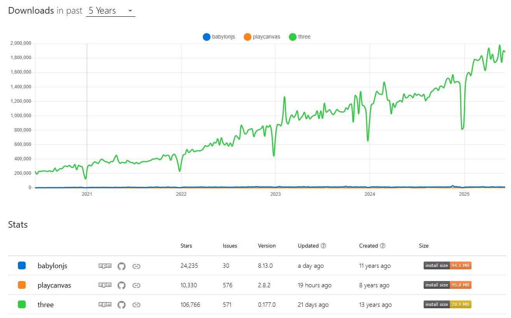

# ThreeJS demo app

## Goal

- [ ] Demo a 3D SPA using your chosen 3D framework
- [ ] Ensure application is **responsive** and works on **standard desktop browsers**

## Getting Started

First, run the development server:

```bash
npm run dev
# or
yarn dev
# or
pnpm dev
# or
bun dev
```

Open [http://localhost:3000](http://localhost:3000) with your browser to see the result.

## The state of 3D web rendering

While many 3D rendering libraries are currently available, my cursory research highlighted the following contenders:

1. [three.js](https://threejs.org/)
1. [Babylon.js](https://www.babylonjs.com/), 24K stars on Github
1. [PlayCanvas](https://playcanvas.com/)

### 3D library pros & cons

| Name                                     | Pros                                                                                                                                                                                                                                                                                                                                     | Cons                                                                                                       | Github ⭐ |
| ---------------------------------------- | ---------------------------------------------------------------------------------------------------------------------------------------------------------------------------------------------------------------------------------------------------------------------------------------------------------------------------------------- | ---------------------------------------------------------------------------------------------------------- | --------- |
| [three.js](https://threejs.org/)         | <br>- Wide 3D rendering features <br>- Mature React integration via [React Three Fiber](https://r3f.docs.pmnd.rs/getting-started/introduction) (29K⭐) <br>- Collection of ready-made "plugins" via [Drei](https://drei.docs.pmnd.rs/getting-started/introduction) (9K⭐) <br>- Continuous historical growth                             | - Complexity due to low-level graphics API <br>- No professional support AFAICT                            | 107K⭐    |
| [Babylon.js](https://www.babylonjs.com/) | <br>- Wide 3D rendering features <br>- 3D Editor <br>- [React-Babylonjs renderer](https://github.com/brianzinn/react-babylonjs) (0.9K⭐ ) <br>- Supported by Microsoft                                                                                                                                                                   | - Extraneous features due to being a game engine (E.g. physic engine) <br>- Smaller community than threejs | 24K⭐     |
| [PlayCanvas](https://playcanvas.com/)    | <br>- Wide 3D rendering features <br>- Comprehensive 3D Editor & Asset tooling <br>- Online integration via [Web Component API](https://developer.playcanvas.com/user-manual/web-components/) or [React renderer](https://playcanvas-react.vercel.app/docs/guide/getting-started) <br>- [Paid app hosting](https://playcanvas.com/plans) | - Extraneous features due to being a game engine (E.g. physic engine) <br>- Much smaller community         | 10K⭐     |

All three engines support advanced rendering features like PBR texturing or transparency.

_See also this [Wikipedia WebGL frameworks comparison table](https://en.wikipedia.org/wiki/List_of_WebGL_frameworks) for more info._

### npm download trends of babylonjs vs playcanvas vs three.js in the last 5 years


[_Source_](https://npmtrends.com/babylonjs-vs-playcanvas-vs-three)

### Which 3D library to choose?

It's clear that three.js is the most mature & popular 3D WebGL library out there. It has a large active community providing lots of reusable code samples and, after 11 years of activity, shows no sign of slowing down.

On the other hand, Babylon.js and PlayCanvas are still very potent contenders thanks to their graphic feature completeness and e2e production tooling. But they seem to appeal to a smaller professional audience (e.g. game studios) as they are built & marketed as game engines; which is overkill for most general web applications.

For the purpose of this 3D demo app, I'll use three.js.
